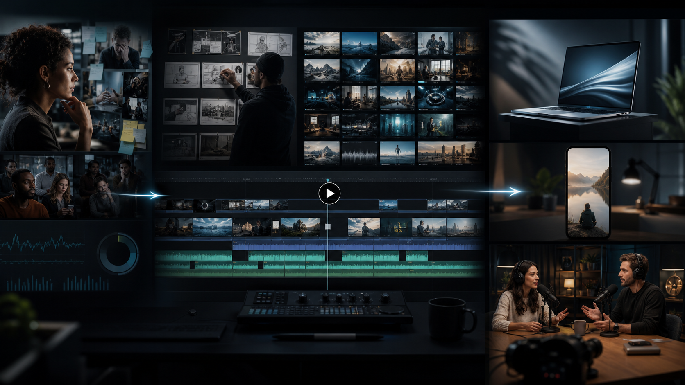
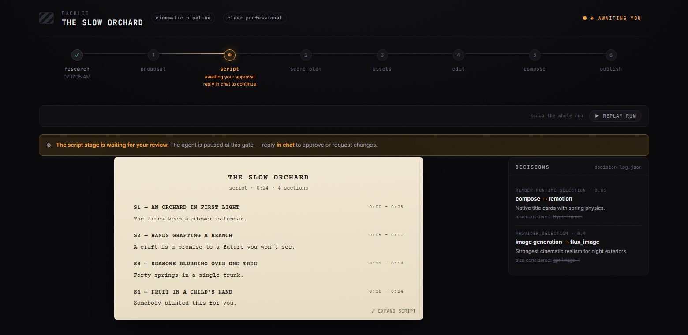
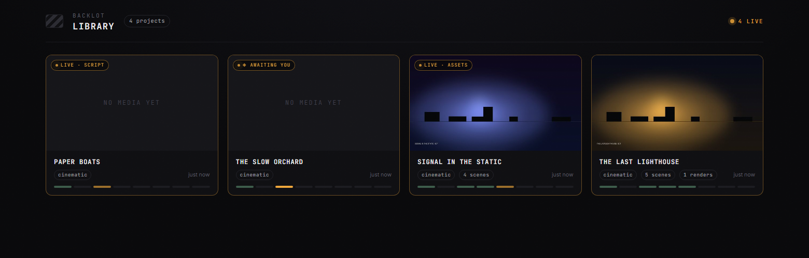

<div align="center">


# CodexVideo

### Give Codex a product, footage, or an idea. Get a production system, not a one-shot prompt.

CodexVideo researches the audience, finds the pain behind the search, writes the hook and script, plans proof-bearing shots, sources or generates media, builds the edit, adds voice and captions, runs quality checks, and exports campaign-ready video.

[](https://github.com/tengbot/codexvideo/actions/workflows/ci.yml)
[](LICENSE)
[](Makefile)
[](https://github.com/calesthio/OpenMontage)

**16 production pipelines | 130 registered tools | 29 capabilities**

**No API key is required for the first render.** Run the checked-in Remotion demos locally, then add only the providers your production actually needs.



</div>

---

<div align="center">

**[Quick Start](#quick-start) | [First Production](#your-first-production) | [What It Makes](#what-it-makes) | [Pipelines](#production-pipelines) | [Under the Hood](#under-the-hood) | [Keys and Cost](#api-keys-and-cost)**

</div>

---

## Why This Exists

Most AI video tools jump from prompt to generation. That is the easy part.

The difficult work happens between an idea and a finished edit: understanding why someone cares, choosing one human problem, writing a hook that earns the next three seconds, proving the claim on screen, keeping the visual language coherent, controlling cost, and producing variants without losing track of what changed.

CodexVideo turns that work into an inspectable production process:

```text
product truth -> consumer pain -> hook -> script -> proof plan -> shot plan
-> assets -> voice -> composition -> captions -> QA -> campaign variants
```

Codex is the control plane. It reads the selected YAML pipeline, follows stage-specific production skills, calls local or cloud tools, records decisions, and stops at configured approval gates. Python provides tools and persistence; Remotion, HyperFrames, and FFmpeg provide the render floor.

> The goal is not to let AI make every decision. The goal is to make every production decision visible, reversible, and repeatable.

## What It Makes

| Format | What the viewer gets | Best starting pipeline |
| --- | --- | --- |
| **Product promotion** | A pain-first product story with a three-second hook, visual proof, and one clear CTA | `product-promo-factory` |
| **Faceless narrative** | English narration, purposeful B-roll or generated motion, dynamic captions, music, and no on-camera presenter | `faceless-narrative` |
| **AI dialogue podcast** | Two distinct hosts, a guided consumer conversation, stable visual continuity, evidence inserts, and captions | `ai-dialogue-podcast` |
| **Footage repurposing** | Transcript-aligned clips, scored candidates, confirmed cut points, reframing, subtitles, and batch exports | `clip-factory` or `podcast-repurpose` |
| **Product walkthrough** | Screen capture, interface focus, cursor choreography, callouts, and a structured software demonstration | `screen-demo` |
| **Launch film** | Bespoke motion direction, cinematic pacing, sound design, and a polished product reveal | `cinematic` or `animation` |

CodexVideo can deliver `9:16`, `1:1`, and `16:9` outputs, burn captions, append CTAs, compress exports, and assemble controlled hook/body/CTA variants from one approved campaign plan.

## What Makes It Different

- **Research before script.** Product claims and consumer pains are separated, ranked, and grounded before a hook is chosen.
- **Proof before decoration.** A claim must map to a product capture, source, demonstration, or explicitly labeled generated visual.
- **Scripts before expensive calls.** Story, scene intent, voice, visual treatment, provider, and budget can be reviewed before generation begins.
- **Human gates where they matter.** Script, cuts, subtitles, visual direction, title, and final output can each require approval.
- **Providers stay replaceable.** The selected model, voice, runtime, cost, and fallback are logged instead of disappearing inside an opaque workflow.
- **Batching is an experiment.** Hooks, bodies, CTAs, formats, and treatments vary through an auditable campaign matrix, not random regeneration.
- **The source remains untouched.** Footage-led workflows create transcripts, timelines, proxies, and renders alongside the original media.


## Quick Start

### Requirements

- Python 3.10 or newer
- Node.js 18 or newer
- FFmpeg
- Codex

### Install

```bash
git clone https://github.com/tengbot/codexvideo.git
cd codexvideo
make setup
```

`make setup` creates a Python environment, installs the Remotion composer, prepares optional local TTS, warms the HyperFrames runtime, and creates an ignored `.env` from `.env.example`.

### Render the zero-key demos

```bash
make demo-list
make demo
```

The included demos use checked-in Remotion components and local rendering. Finished files appear in:

```text
projects/demos/renders/
```

No image, video, voice, or orchestration API key is needed for this path.

### Inspect the machine before production

```bash
make preflight
make hyperframes-doctor
```

Preflight discovers the tools that are actually available on the current machine. Codex should use that live capability menu instead of assuming every provider is configured.

## Your First Production

Open the repository in Codex and describe the outcome. A useful product-video request is:

```text
Use the product-promo-factory pipeline for https://example.com.
Research the product from the consumer's perspective. Rank the strongest pains,
make one pain clear in the first three seconds, prove the solution visually,
use English voiceover, and end with one CTA. Present the script, proof plan,
rendering options, provider choices, and estimated cost before paid generation.
```

For a faceless video:

```text
Create a 25-second 9:16 faceless English video from this product URL.
Use real motion footage where possible, keep every claim source-grounded,
match each visual to the spoken idea, add dynamic captions, and export three hooks.
```

For a dialogue format:

```text
Turn this product into a two-host English podcast conversation.
Give one host the consumer problem and the other the informed answer.
Keep the exchange natural, use evidence inserts, and finish with a soft CTA.
```

Codex then follows the repository contract in [`AGENT_GUIDE.md`](AGENT_GUIDE.md): select a pipeline, inspect capabilities, present consequential choices, execute stage by stage, checkpoint artifacts, review the result, and resume from the last approved state when revisions are needed.

## The Production Board

Every project is a folder, not a hidden session. The Backlot board exposes the production state: approved script, scene plan, asset status, provider decisions, cost, activity, storyboard, and render history.






This makes it possible to stop after the script, revise one scene, rerun a failed stage, compare campaign variants, or inspect why a provider and render path were chosen.

## Production Pipelines

| Pipeline | Primary job |
| --- | --- |
| `product-promo-factory` | Consumer-pain research, hooks, proof planning, product shots, and campaign variants |
| `faceless-narrative` | Narration-led short-form video with sourced or generated visuals |
| `ai-dialogue-podcast` | Two-host conversational product storytelling |
| `screen-demo` | Software walkthroughs and interface demonstrations |
| `clip-factory` | Batch short-form clips from long recordings |
| `podcast-repurpose` | Podcast highlights converted into visual social clips |
| `talking-head` | Footage-led presenter edits |
| `avatar-spokesperson` | Generated presenter and avatar videos |
| `localization-dub` | Translation, dubbing, subtitle, and format localization |
| `hybrid` | Original footage combined with sourced or generated support media |
| `documentary-montage` | Research-led montage and documentary structure |
| `animated-explainer` | Narrated explainers with visualized ideas and data |
| `animation` | Motion graphics and kinetic typography |
| `character-animation` | Rigged character scenes and authored animation timelines |
| `cinematic` | Trailers, teasers, launch films, and story-driven edits |
| `framework-smoke` | Minimal framework and provider validation |

Each manifest in [`pipeline_defs/`](pipeline_defs/) defines its stages, artifacts, quality gates, tools, skills, and checkpoint behavior. The focused CodexVideo formats extend the upstream [OpenMontage](https://github.com/calesthio/OpenMontage) pipeline library rather than replacing it.

## Under the Hood

```text
Brief, URL, or footage
          |
          v
Codex reads pipeline_defs/<format>.yaml
          |
          v
Stage director skills guide research, script, assets, edit, and publish
          |
          v
Tool registry selects available local or cloud capabilities
          |
          v
JSON artifacts + checkpoints + append-only decision history
          |
          v
Remotion / HyperFrames / FFmpeg composition
          |
          v
Decode, frame, subtitle, audio, checksum, and delivery QA
```

### Rendering choices

| Runtime | Best at | Tradeoff |
| --- | --- | --- |
| **Remotion** | Deterministic React compositions, reusable templates, captions, data, and batch variants | Bespoke motion requires authored components |
| **HyperFrames** | One-off HTML/GSAP art direction, spatial motion, camera language, and product-launch work | More creative implementation and iteration |
| **FFmpeg** | Trimming, reframing, stitching, subtitle burn-in, audio mixing, compression, and delivery automation | It is an editing and encoding floor, not a full creative system by itself |

When both Remotion and HyperFrames are available, the agent presents both with project-specific tradeoffs before the render runtime is locked.

### Repository map

```text
codexvideo/
|-- pipeline_defs/          # 16 production manifests
|-- skills/                 # stage directors, production policy, and review knowledge
|-- .agents/skills/         # provider, rendering, motion, and media craft skills
|-- tools/                  # local and cloud production tools
|-- schemas/                # artifact, checkpoint, pipeline, and tool contracts
|-- lib/                    # configuration, checkpoints, media profiles, and cost control
|-- backlot/                # inspectable local production board
|-- remotion-composer/      # deterministic React video compositions
|-- tests/                  # contract, tool, rendering, and workflow coverage
`-- projects/               # ignored local workspaces and renders
```

For the full system description, see [`docs/ARCHITECTURE.md`](docs/ARCHITECTURE.md).

## API Keys and Cost

You do not need a bag of API keys to start.

| Level | What it enables | Keys |
| --- | --- | --- |
| **Local floor** | Remotion and FFmpeg composition, checked-in demos, supplied footage, subtitles, QA, and optional local TTS | None |
| **Sourcing** | Stock footage and images from Pexels, Pixabay, or Unsplash | Add only the chosen library's key |
| **Generation** | Image, video, voice, music, avatar, or lip-sync providers | Add only the approved provider's key |
| **Local GPU** | Selected transcription, image, video, enhancement, avatar, and lip-sync paths | No provider key; hardware and model downloads may be required |

The repository does not use a separate LLM API as its orchestration brain: Codex is already the agent. Some media tools can optionally use OpenAI or another cloud provider, but that is a production choice, not a framework requirement.

Before a paid or consequential call, the production contract requires the exact tool, provider, model or variant, reason, sample-or-batch scope, and cost expectation to be shown. A blocked provider is not silently replaced with another one.

Store credentials only in the ignored `.env` file or your own secret manager. Never paste keys into project artifacts, prompts committed to Git, or rendered metadata.

## Quality and Reproducibility

CodexVideo combines creative review with mechanical checks:

- JSON Schema validation for production artifacts and checkpoints
- Resumable stages and failed-stage reruns
- Append-only provider, model, voice, and runtime decisions
- Source-grounded product claims and visual-proof mapping
- FFprobe metadata validation and full decode checks
- Frame sampling and visual inspection
- Subtitle timing, safe-area, and readability checks
- Audio duration, mix, and silence checks
- Checksums, batch manifests, and export reports

Run the full Python suite:

```bash
make test
```

Check the Remotion project:

```bash
cd remotion-composer
npm install
npx tsc --noEmit
```

## Status and Boundaries

CodexVideo is a local-first, open-source production toolkit. It is not yet a hosted SaaS product, and it does not promise that one prompt will produce a finished campaign without review.

- Cloud media generation requires the relevant provider account and current terms.
- Local model paths may require substantial RAM, VRAM, disk space, and setup.
- Generated people, voices, brands, claims, music, and footage must be reviewed for consent, rights, accuracy, and platform policy.
- Provider availability, pricing, model behavior, and output quality can change independently of this repository.
- Expensive generation should begin with short samples and approved creative direction.

That boundary is intentional: the system automates production labor while keeping editorial and commercial judgment visible.

## Upstream and Contributing

CodexVideo is built on [OpenMontage](https://github.com/calesthio/OpenMontage) and preserves its attribution and licensing. CodexVideo publishes a standalone snapshot history so its contributor graph represents work on this repository; upstream updates are imported as reviewed code differences rather than merged commit ancestry. See [`docs/UPSTREAM_SYNC.md`](docs/UPSTREAM_SYNC.md).

Contributions that improve production reliability, provider portability, media provenance, accessibility, cost control, or measurable creative quality are welcome. Start with [`CONTRIBUTING.md`](CONTRIBUTING.md).

## License

CodexVideo is released under the [GNU Affero General Public License v3.0](LICENSE). Vendored skills, media, and adapted components may carry additional notices in their respective directories.

---

<div align="center">

**CodexVideo. Research the need. Prove the promise. Ship the video.**

</div>
